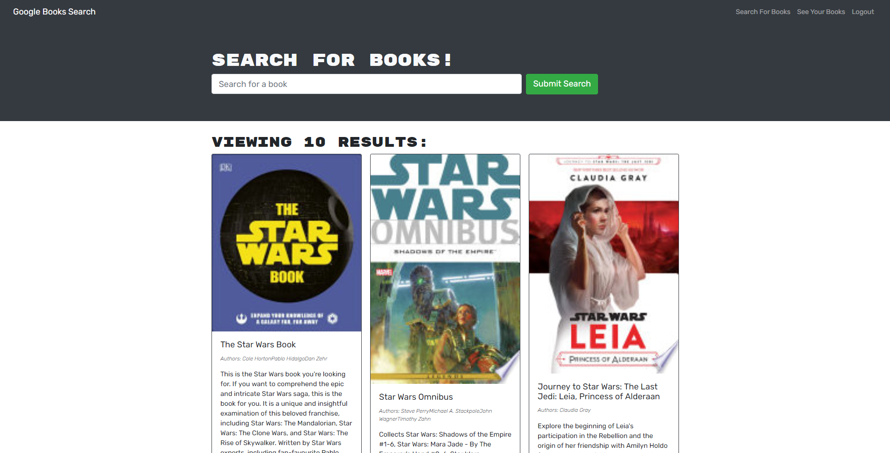
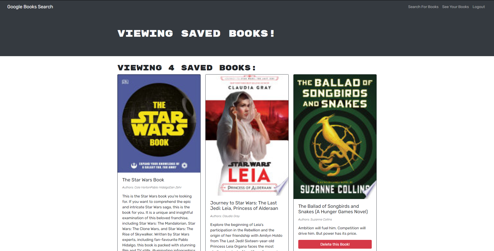

# Book Search Engine 
[See the app here]()  



## Description
The goal for this project was to convert a working book search website, in to an application where users can save books they find interesting so they can read them later. I accomplished this goal using Apollo server and GraphQL to connect the front end to a custom backend.

* [Contribution](#Contribution)
* [Technologies](#Technologies-Used)
* [Contact](#Contact)

## User Story

```

AS AN avid reader
I WANT to search for new books to read
SO THAT I can keep a list of books to purchase

```

## Contribution
You can contribute to this project by making a pull request or sending me an email.


## Technologies Used
- MERN Stack
- Graphql

## Contact
    Contact Me With Any Questions, Comments or Anything Else
https://github.com/grey-whitt

greywhitt@gmail.com


[License](https://www.contributor-covenant.org/)

Greyson Whittenberger 2020